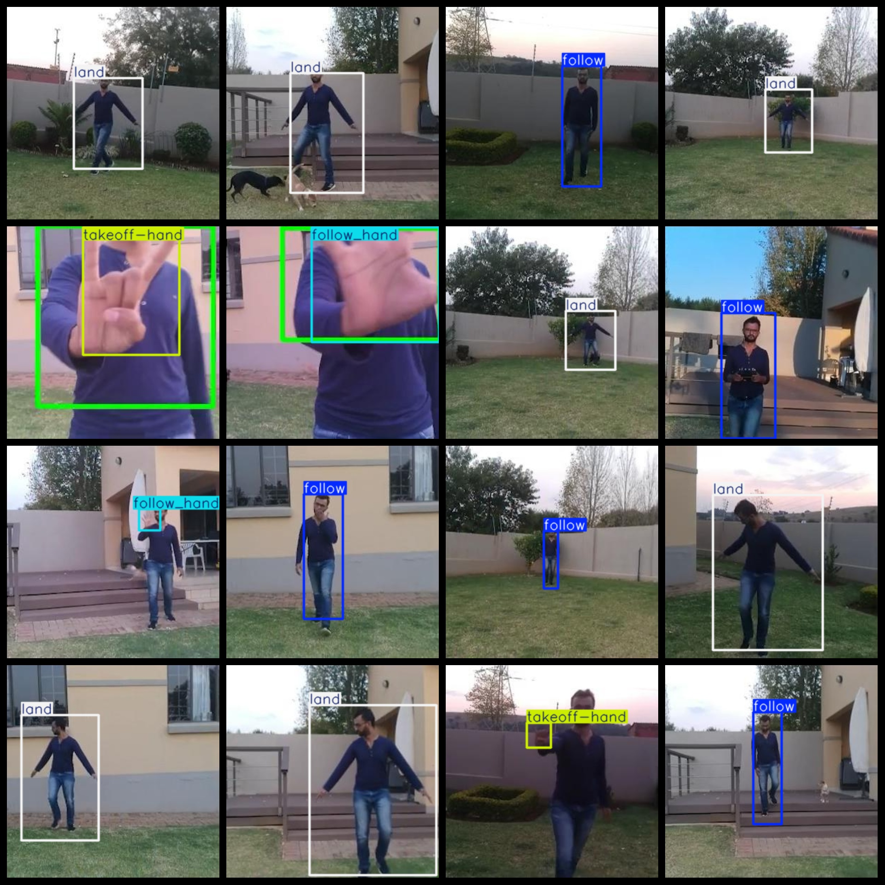

# UAV Hand Potential control Dataset 46176 imagesVOC+YOLO format

Drones gesture control dataset 46176 VOC + YOLO format

Dataset Format: VOC format + YOLO format

The compressed file contains: three folders, each storing images, xml files, and text files.

Total jpg images in JPEGImages folder: 46176

The total number of XML files in the Annotations folder is: 46176.

The total number of txt files in the labels folder is 46,176.

Number of tag types: 8

Tag names: ["follow","follow_hand","land","land_hand","null","object","takeoff","takeoff-hand"]

The number of boxes for each label (Note that the order of labels in the Yolo format does not correspond to this, but is based on the classes.txt file in the labels folder):

follow frame count = 22056

follow_hand frame count = 4038

land frame count = 7609

land_hand frame count = 3300

null frame count = 2642

object frame count = 2

takeoff frame count = 3494

takeoff-hand frame count = 3645

Total boxes: 46786

Picture clarity (Resolution: Pixels): Clear

Is the image enhanced: No

Shape of the label: Rectangular box, used for object detection and recognition.

Important Note: None

Special Notice: This dataset does not guarantee the accuracy or precision of the trained models or weight files. The dataset only provides accurate and reasonable annotations.

Annotation and image details are as follows:

## Images

---

Here is a pay link on Stripe (https://buy.stripe.com/3cs8yP7sY87d0vu9AB). Please contact me lonlonago@foxmail.com after funding $89, and I will send you a complete data files, thank you!

